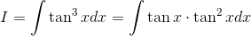
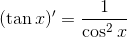

# 【高校数学】今週の積分 #1 【難易度★★】

<!--

-->

https://www.youtube.com/watch?v=vm7LcyupMs0

----
三角関数が出てくる積分の場合まず考えること。

発想：三角関数は二乗に強い。

----

まずは二乗を抜き出してみる。

<!--
 
-->

<!--

-->

 を展開して変形させる。 

<!--
dx=\int\tan&space;x\cdot\frac{1}{\cos^2x}dx-\int\tan&space;xdx)
-->

-----

ここで

<!--
'=\frac{1}{\cos^2x})
-->

<!--
'}{\cos&space;x}dx)
-->

であることに注目して変形すると

----

<!--
'dx&plus;\int\frac{(\cos&space;x)'}{\cos&space;x}dx)
-->

----

そして以下がなりたつ。

<!--
)^n\cdot(f(x))'dx=\frac{1}{n&plus;1}(f(x))^{n&plus;1}&plus;C)
-->

<!--
)'}{f(x)}dx=\log|f(x)|&plus;C)
-->

----

従って積分結果は次のようになる。

<!--
'dx&plus;\int\frac{(\cos&space;x)'}{\cos&space;x}dx=\frac{1}{2}\tan^2x&plus;\log|\cos&space;x|&plus;C)
-->

以上。
