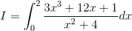
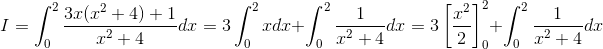
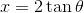
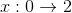
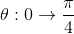
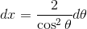
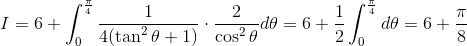

# 【高校数学】今週の積分#10【難易度★★★】

<!--

-->

https://www.youtube.com/watch?v=YGbuDXXa6dk

----

発想：分子の次数が分母の次数と同じか大きいときには、整式の乗除で分子の次数を下げる。

----

<!--
&plus;1}{x^2&plus;4}dx=3\int_0^2xdx&plus;\int_0^2\frac{1}{x^2&plus;4}dx=3\left[\frac{x^2}{2}\right&space;]_0^2&plus;\int_0^2\frac{1}{x^2&plus;4}dx)
-->

第二項は置換積分ができる。

----

<!--

-->

<!--

-->

<!--

-->

<!--

-->

----

第一項の定積分を計算し、第二項の置換積分を行うと、

<!--
}\cdot\frac{2}{\cos^2\theta}d\theta=6&plus;\frac{1}{2}\int_0^\frac{\pi}{4}d\theta=6&plus;\frac{\pi}{8})
-->

以上。
