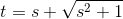

# 【高校数学】今週の積分#14【難易度★★★★★】

<!--

-->

https://www.youtube.com/watch?v=26EXOUgtgOg

----

発想：

<!--

-->

を含む形のときには、

<!--

-->

と置換する。

双曲線関数でも可。#6 参照。

----

根号の中を平方完成する。

<!--
^2&plus;4}=2\sqrt{(\frac{x&plus;3}{2})^2&plus;1})
-->

<!--
^2&plus;1}}dx)
-->

ここで、次のようにすれば上の発想の形に変形できる。

----

<!--

-->

<!--

-->

----

<!--

-->

ここで発想の置換を行う。

----

<!--

-->

<!--
ds=\frac{s&plus;\sqrt{s^2&plus;1}}{\sqrt{s^2&plus;1}}ds=\frac{t}{\sqrt{s^2&plus;1}}ds)
-->

<!--

-->

----

置換すると、

<!--

-->

変形して、

<!--
^2&plus;1}|&plus;C)
-->

定数項を整理して、

<!--

-->

以上。
