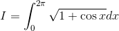
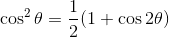
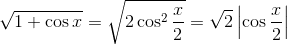
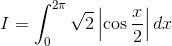
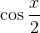
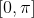
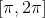
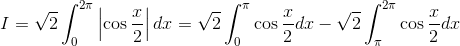
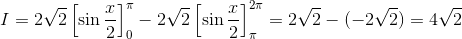

# 【高校数学】今週の積分 #2 【難易度★★】

<!--

-->

https://www.youtube.com/watch?v=cORrgWIjr9g

----
根号があると積分しにくい。

発想：根号は外す

----

半角の公式によると

<!--
)
-->

なのでこれで根号がはずせそう。

----

<!--
 
-->

ゆえに

<!--
 
-->

----
ここで 

<!--

-->

 の符号は、区間 
 
<!--

-->

 
  でプラス、区間 
  
<!--

-->

  
   でマイナスとなることから、次のようになる。

<!--
 
-->

-----

従って、積分結果は次のようになる。

<!--
=4\sqrt{2})
-->

以上。
