# 【高校数学】今週の積分#22【難易度★★★★★】

<!--

-->
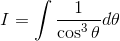

https://www.youtube.com/watch?v=bwNJ8mVhlF4

----

発想：三角関数は二乗に強い。

----

とりあえず二乗の形を作ってみる。

<!--

-->
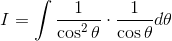

部分積分をして、

<!--
'\cdot\frac{1}{\cos\theta}d\theta)
-->
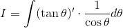

<!--

-->
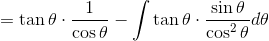

<!--

-->
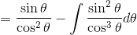

<!--

-->
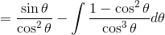

<!--

-->
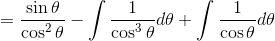

<!--

-->
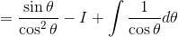

同形出現となったので、

<!--

-->
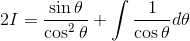

第二項の積分を行うと、

----

<!--

-->
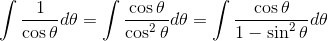

<!--

-->
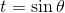

<!--

-->
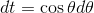

----

置換して、部分分数分解をすると、

<!--
dt)
-->
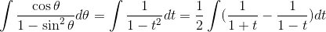

<!--
&plus;C)
-->
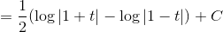

<!--
&plus;C)
-->
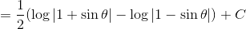

<!--

-->
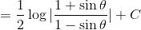

----

従って、

<!--

-->
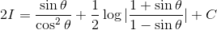

<!--

-->
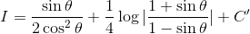

以上。
