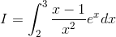
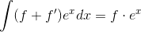
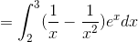
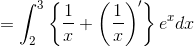
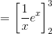
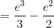

# 【高校数学】今週の積分#25【難易度★★★★】

<!--

-->

https://www.youtube.com/watch?v=hTP0e0we6QQ

----

発想

<!--
'=(f&plus;f')e^x)
-->

なので

<!--
e^xdx=f\cdot&space;e^x)
-->

----

<!--

-->

<!--
e^xdx)
-->

<!--
'\right\}e^xdx)
-->

<!--

-->

<!--

-->

