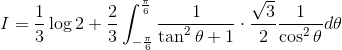

# 【高校数学】今週の積分#28【難易度★★★★★】

<!--

-->

https://www.youtube.com/watch?v=YkbuXTr4w_Y

----

発想：

分母が因数分解できる場合は部分分数分解を行う。

----

与式を部分分数分解する。

<!--

-->

積分すると、

<!--
'-3}{x^2-x&plus;1}dx)
-->

<!--

-->

<!--

-->

<!--
^2&plus;(\frac{\sqrt{3}}{2})^2}dx)
-->

<!--
^2&plus;1}dx)
-->

----

ここで以下の置換を行う。

<!--

-->

<!--

-->

<!--

-->

<!--

-->

----

置換を行うと、

<!--

-->

<!--

-->

<!--

-->

以上。
