# 【高校数学】今週の積分#3【難易度★★★★】

<!--

-->
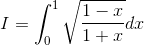

https://www.youtube.com/watch?v=GJKxttevVWg

----

発想：

<!--

-->
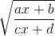

の場合は

<!--

-->
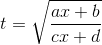

と置換すると t だけの式となる。

----

<!--

-->
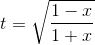

とすると、積分範囲は次のようになる。

<!--

-->
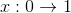

<!--

-->

そして

<!--

-->
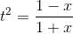

より

<!--

-->
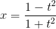

<!--
-2t(1-t^2)}{(1&plus;t^2)^2}=\frac{-4t}{(1&plus;t^2)^2})
-->
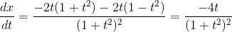

<!--
^2}dt)
-->
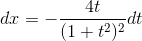

----

以上を用いて置換積分すると次のようになる。

<!--
^2}\right)dt=4\int_0^1\frac{t^2}{(1&plus;t^2)^2}dt)
-->
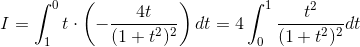

ここでさらに置換積分をする。

----

<!--

-->

とすると、積分範囲は次のようになる。

<!--

-->
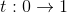

<!--

-->
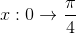

そして

<!--

-->
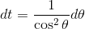

----

以上を用いて置換積分すると次のようになる。

<!--

-->
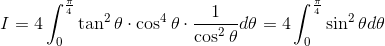

半角の公式を使って次数をさげると、

<!--
d\theta=2\int_0^\frac{\pi}{4}\left(1-\cos2\theta\right)d\theta)
-->
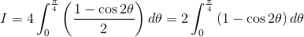

定積分を計算すると次のようになる。

<!--
=\frac{\pi}{2}-1)
-->
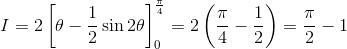

以上。
