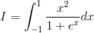
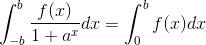
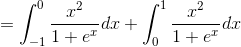
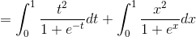
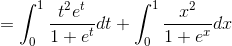
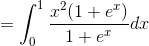
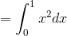
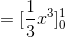
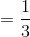

# 【高校数学】今週の積分#31【難易度★★★★★】

<!--

-->

I=\int_{-1}^1\frac{x^2}{1+e^x}dx

https://www.youtube.com/watch?v=NZ1lPPmx89k

----

発想：

f(x) が偶関数のとき、

<!--
}{1&plus;a^x}dx=\int_0^bf(x)dx)
-->

----

<!--

-->

<!--

-->

<!--

-->

<!--

-->

<!--
}{1&plus;e^x}dx)
-->

<!--

-->

<!--

-->

<!--

-->

