# 【高校数学】今週の積分#38【難易度★★★★★】

<!--

-->
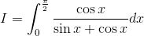

https://www.youtube.com/watch?v=_Cx6pncAJv4

----

発想：

sin と cos の対称性に注目する。

<!--
=\cos{x})
-->
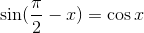

<!--
=\sin{x})
-->
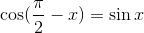

----

<!--

-->
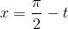

<!--

-->
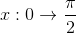
<!--

-->
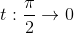

<!--

-->

----

<!--

-->

<!--

-->
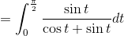

<!--

-->
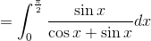

<!--

-->
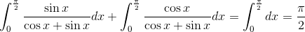

<!--

-->
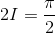

<!--

-->
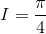
