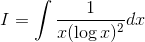
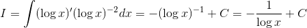

# 【高校数学】今週の積分#40【難易度★★】

<!--
^2}dx)
-->

https://www.youtube.com/watch?v=Ob1hxQCtMAU

----

発想：

<!--
 
-->

が入った積分に

<!--

-->

があるときには、微分形の接触を疑う。

----

<!--
'(\log&space;x)^{-2}dx=-(\log&space;x)^{-1}&plus;C=-\frac{1}{\log&space;x}&plus;C)
-->

以上。
