# 【高校数学】今週の積分#43【難易度★★★★★】

<!--

-->
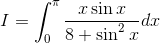

https://www.youtube.com/watch?v=lLhsvW8VqQ0

----

発想：

<!--
dx=\frac{\pi}{2}\int_0^\pi{f(\sin{x})}dx)
-->
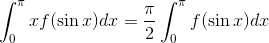

----

<!--
dx)
-->
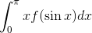

<!--
f(\sin(\pi-t))dt)
-->
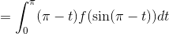

<!--
dt-\int_0^{\pi}tf(\sin{t})dt)
-->
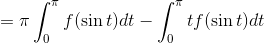

<!--
dx-\int_0^{\pi}xf(\sin{x})dx)
-->
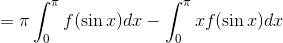

<!--
dx=\frac{\pi}{2}\int_0^{\pi}f(\sin{x})dx)
-->
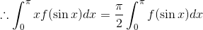

----
よって、

<!--

-->
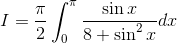

<!--

-->
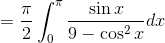

----

ここで次の置換を行う。

<!--

-->
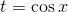

<!--

-->
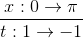

<!--

-->
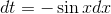

----

従って、

<!--

-->
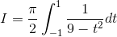

<!--
(3&plus;t)}dt)
-->
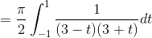

<!--
dt)
-->
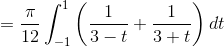

<!--

-->
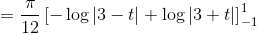

<!--
)
-->
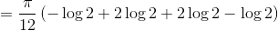

<!--

-->
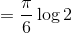

以上。
