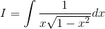
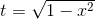
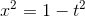
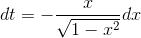
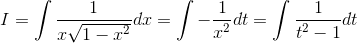
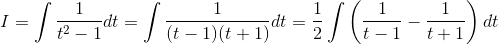
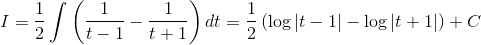
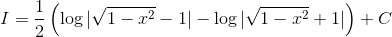

# 【高校数学】今週の積分 #61 【難易度★★】

<!--

-->

https://www.youtube.com/watch?v=KJNePK-t--E

----

根号があると、積分はやりにくい。というわけで、

発想：根号は基本的に外す。

実は [#60](60.md) と根号の中の符号が異なるだけなのだが、積分の結果は違う形になる。

----

<!--

-->

 とおくと 

<!--

-->

 となるので、

----

<!--

-->

----

ゆえに置換積分すると次のようになる。

<!--

-->

ここで部分分数分解をすれば、

<!--
(t&plus;1)}dt=\frac{1}{2}\int\left(\frac{1}{t-1}-\frac{1}{t&plus;1}\right)dt)
-->

従って、

<!--
dt=\frac{1}{2}\left(\log|t-1|-\log|t&plus;1|\right)&plus;C)
-->

そして 

<!--

-->

 なので、

<!--
&plus;C)
-->

以上。
