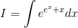
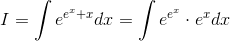
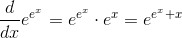
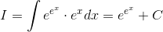

# 【高校数学】今週の積分#62【難易度★】

<!--

-->

https://www.youtube.com/watch?v=PuoWaYvpujU

----

発想：複雑な指数はバラす。

----

とりあえず指数をバラすと…

<!--

-->

ここで、

<!--

-->

 の微分を考えると

<!--

-->

であることから、

<!--

-->

以上。
