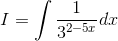
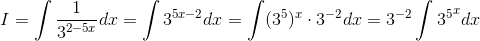
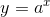
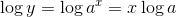
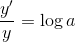
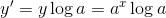
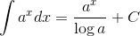
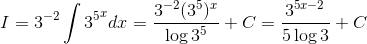

# 【高校数学】今週の積分#63【難易度★★】

<!--

-->

https://www.youtube.com/watch?v=p5wpEw7Powo

----

発想：複雑な指数はバラす。

----

とりあえず指数をバラすと…

<!--

-->

----

ここで対数微分法を使って 

<!--

-->

 の微分を考える。

両辺の対数をとる。

<!--

-->

両辺を微分すると

<!--

-->

したがって

<!--

-->

であることから、

<!--

-->

となる。

----

したがって、

<!--

-->

以上。
