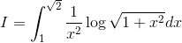
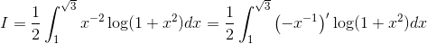
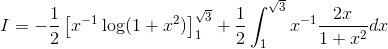
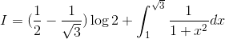
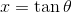
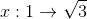
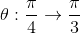
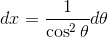
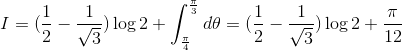

# 【高校数学】今週の積分#65【難易度★★★★】

<!--

-->

https://www.youtube.com/watch?v=efqQCaGMVRE

----

発想： log 関数を使う関数の積分では、部分積分を考え、log 関数を微分する方にしてみる。log 関数は積分は難しいが微分は簡単なので。

----

log 関数の中を単純化し、式を整理する。

<!--
dx&space;=\frac{1}{2}\int_{1}^{\sqrt{3}}\left(-x^{-1}\right)'\log(1&plus;x^2)dx)
-->

log 関数を微分する方として、部分積分を行うと、

<!--
\right]_{1}^{\sqrt{3}}&plus;\frac{1}{2}\int_{1}^{\sqrt{3}}x^{-1}\frac{2x}{1&plus;x^2}dx)
-->

第一項の定積分を計算すると、

<!--
\log{2}&plus;\int_1^{\sqrt{3}}\frac{1}{1&plus;x^2}dx)
-->

ここで第二項の置換積分を行う。

----

<!--

-->

とおく。

<!--

-->

<!--

-->

<!--

-->

----

上の置換積分を実施すると、次のようになる。

<!--
\log{2}&plus;\int_{\frac{\pi}{4}}^{\frac{\pi}{3}}d\theta=(\frac{1}{2}-\frac{1}{\sqrt{3}})\log{2}&plus;\frac{\pi}{12})
-->

以上。
