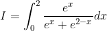
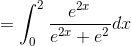
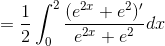
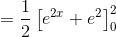
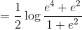
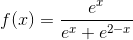
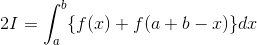
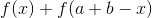
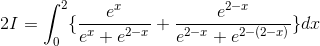
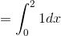

# 【高校数学】今週の積分#68【難易度★★★】

<!--

-->

https://www.youtube.com/watch?v=kBJAtB31Jcw

----

発想：微分形の接触を作る

----

<!--

-->

<!--
'}{e^{2x}&plus;e^{2}}dx)
-->

<!--

-->

<!--

-->

<!--

-->

<!--

-->

----

King Property を使って解く。

<!--
=\frac{e^x}{e^x&plus;e^{2-x}})
-->

<!--
&plus;f(a&plus;b-x)\}dx)
-->

この積分の場合、
<!--
&plus;f(a&plus;b-x))
-->

が簡単に積分できるので King Property の適用は有効である。

<!--
}}\}dx)
-->

<!--

-->

<!--

-->

<!--

-->

以上。