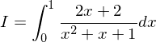
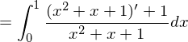
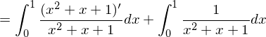
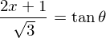
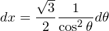
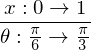
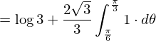
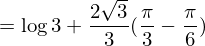
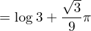

# 【高校数学】今週の積分#69【難易度★★★★】

https://www.youtube.com/watch?v=PEDEjqrRHq4

----

【発想】

(一次式)/(二次式) の場合は、分子に分母の微分形を作る。

----

![=[\log|x^2+x+1|]_0^1+\frac{4}{3}\int_0^1\frac{1}{(\frac{2x+1}{\sqrt{3}})^2+1}dx](texclip20200504132004.png)

ここで、

で置換すると

より、

