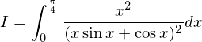

# 【高校数学】今週の積分#70【難易度★★★★★】

https://www.youtube.com/watch?v=6mWSvFYrhFw

----

発想：

微分形の接触を作る。

----

以下に注目する。

----

![\begin{eqnarray}
I & = & \int_0^\frac{\pi}{4}\dfrac{x^2}{(x\sin{x}+\cos{x})^2}dx \nonumber\\
  & = & \int_0^\frac{\pi}{4}\dfrac{x}{\cos{x}}\cdot\frac{x\cos{x}}{(x\sin{x}+\cos{x})^2}dx \nonumber\\
  & = & \int_0^\frac{\pi}{4}\dfrac{x}{\cos{x}}\cdot\frac{(x\sin{x}+\cos{x})'}{(x\sin{x}+\cos{x})^2}dx \nonumber\\
  & = & \left[\dfrac{x}{\cos{x}}\cdot\frac{-1}{x\sin{x}+\cos{x}}\right]_0^\frac{\pi}{4}+\int_0^\frac{\pi}{4}\dfrac{x\sin{x}+\cos{x}}{\cos^2{x}}\cdot\frac{1}{x\sin{x}+\cos{x}}dx\nonumber\\
  & = & \dfrac{\frac{\pi}{4}}{\frac{1}{\sqrt{2}}}\cdot\frac{-1}{\frac{\pi}{4}\frac{1}{\sqrt{2}}+\frac{1}{\sqrt{2}}}+\int_0^\frac{\pi}{4}\dfrac{1}{\cos^2{x}}dx\nonumber\\
  & = & \dfrac{-2\pi}{\pi+4}+[\tan{x}]_0^\frac{\pi}{4}\nonumber\\
  & = & \dfrac{-2\pi}{\pi+4}+1\nonumber\\
  & = & \dfrac{4-\pi}{4+\pi}\nonumber
\end{eqnarray}](texclip20200520012523.png)

以上。
