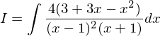
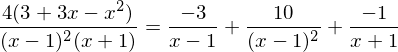

# 【高校数学】今週の積分#73【難易度★★★】

https://www.youtube.com/watch?v=OWNAr-c-pY4

----

発想：分母が素因数分解できる→部分分数分解

分子の次数＞分母の次数の場合は分子の次数を下げてから。

----

より、

上を解くと、

(1) の部分分数分解を完成させる。

以上より、

以上

---

(1) で二項目の分子を定数でなく一次式にする、つまり、

のようにするべきではないかという意見もあるが、

のように (2) に変形できることから、結果として (1) を解いているのと同じこととなる。
