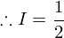

# 【高校数学】今週の積分#75【難易度★★★★★】

https://www.youtube.com/watch?v=BTNplrk0pv0

----

発想：

において、

が単純な形をしているならば、King Property を使う。

----

![\begin{eqnarray}
2I & = & \int_{-1}^1\left\{\dfrac{\sin^2(\pi{x})}{1+e^x}+\dfrac{\sin^2(-\pi{x})}{1+e^{-x}}\right\}dx\\
& = & \int_{-1}^1\left\{\dfrac{\sin^2(\pi{x})}{1+e^x}+\dfrac{e^x\sin^2(\pi{x})}{1+e^{x}}\right\}dx\\
& = & \int_{-1}^1\sin^2(\pi{x})dx\\
& = & \int_{-1}^1\dfrac{1-\cos(2\pi{x})}{2}dx\\
& = & \left[\dfrac{1}{2}x-\dfrac{1}{4\pi}\sin(2\pi{x})\right]_{-1}^1\\
& = & 1
\end{eqnarray}](texclip20200616234144.png)

以上。
