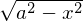

# 【高校数学】今週の積分#84【難易度★★★】

https://www.youtube.com/watch?v=y3_4L4Hh7bk

----

----

【発想】

を含む形ならば、

と置換する。

----

ここでは以下の置換を行う。

(1) を置換すると

![\begin{eqnarray}
I&=&\dfrac{1}{2}\int_0^\frac{\pi}{2}\sqrt{1-\sin^2\theta}\cdot\dfrac{1}{2}\cos\theta dx\nonumber\\
&=&\dfrac{1}{4}\int_0^\frac{\pi}{2}\cos^2\theta d\theta\nonumber\\
&=&\dfrac{1}{4}\int_0^\frac{\pi}{2}\dfrac{1+\cos{2\theta}}{2}d\theta\nonumber\\
&=&\dfrac{1}{4}\left[\dfrac{1}{2}\theta+\dfrac{1}{4}\sin{2\theta}\right]_0^\frac{\pi}{2}\nonumber\\
&=&\dfrac{\pi}{16}\nonumber
\end{eqnarray}](texclip20200820215644.png)

----

【発想2】

を含む形ならば、円の面積を考える。

----

したがって半径が 1/2 の円の 1/4 の面積に等しい。

