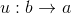
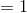
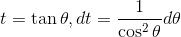
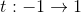

# King Property

<!--
}dx=\int_a^b{f(a&plus;b-x)dx})
-->

https://www.youtube.com/watch?v=xIvYvac4Ok8

----

<!--
}dx=\int_a^b{f(a&plus;b-x)dx})
-->

あるいは

<!--
}dx=\int_0^b{f(b-x)dx})
-->

----

(証明)

<!--

-->

とおくと、

<!--

-->

<!--

-->

<!--

-->

したがって、

<!--
dx})
-->

<!--
}\cdot(-1)du)
-->

<!--
}du)
-->

<!--
}dx)
-->

----

King Property で何ができる？

<!--
}dx=\int_a^b{f(a&plus;b-x)}dx)
-->

少し変形すると、

<!--
+f(a&plus;b-x)}dx)
-->

となる。

<!--
&plus;f(a&plus;b-x))
-->

の部分が簡単な形をしていれば、そこから I の値を求めることができる。

----

例1

<!--
^2}dx)
-->

<!--

-->

<!--
^2}&plus;\frac{(5-x)^2}{(5-x)^2&plus;x^2}\right\}dx)
-->

<!--

-->

<!--

-->

<!--

-->

----

例2

<!--

-->

<!--

-->

<!--
=\sin{x},&space;\cos(\pi-x)=-\cos{x})
-->

<!--
\sin(\pi-x)}{1&plus;\cos^2(\pi-x)}&space;\right\}dx)
-->

<!--
\sin&space;x}{1&plus;\cos^2&space;x}\right\}dx)
-->

<!--

-->

ここで置換する。

<!--

-->

<!--

-->

<!--

-->

より、

<!--

-->

となるのでまたも置換する。

<!--

-->

<!--

-->

<!--

-->

より、

<!--

-->

<!--

-->

<!--

-->

